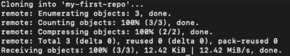

# Instructions

## Command Line meets GitHub
To fork this repository. follow the instructions below.  

1. Click the **Fork** button on the top right.
2. Your new repository will show in your GitHub account.
3. In your newly forked repository, click the **Code** button at the top right. 
4. To clone your repository so you can connect it locally to your machine,  click the copy button indicated in the image.

1. Open your terminal or Git Bash. Type `ls`. This means **list** in command line. You will see the different folders in your current location. 
- If you see a ‘Documents’ folder. Great!
- If you do not, then choose the folder you want to use. 
1. Now, using command line, type the following:
- `cd Documents` if you have a ‘Documents’ folder.
- `cd (name of folder)` if you chose a different folder.
- You should see the folder name attached to your computer name in terminal now which means you are in that folder.
7 Now type `git clone (paste url)` in the terminal and paste the url you copied from GitHub. 
8. Hit return.
9. If you were successful, you should see this image at the bottom. 

Congratulations. You’ve now cloned your first repo to your machine!  

